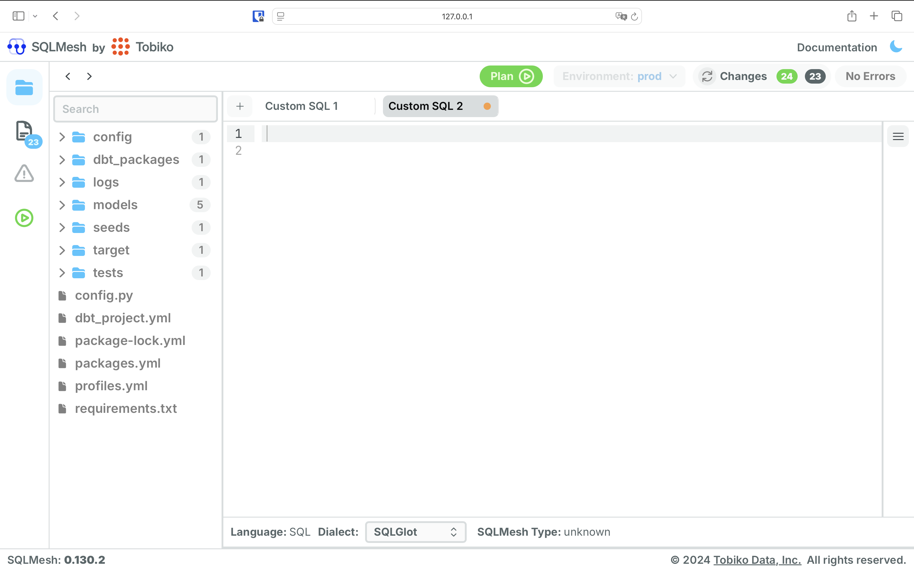
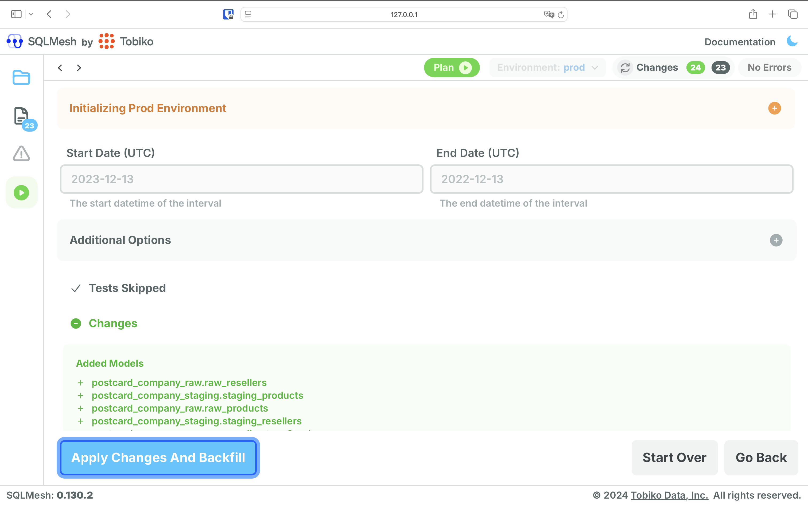
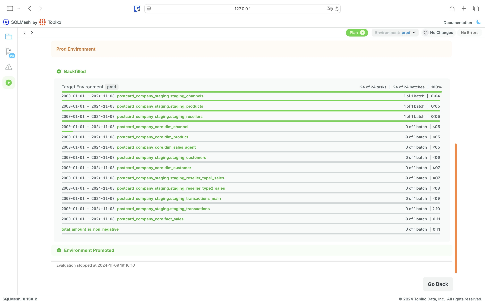
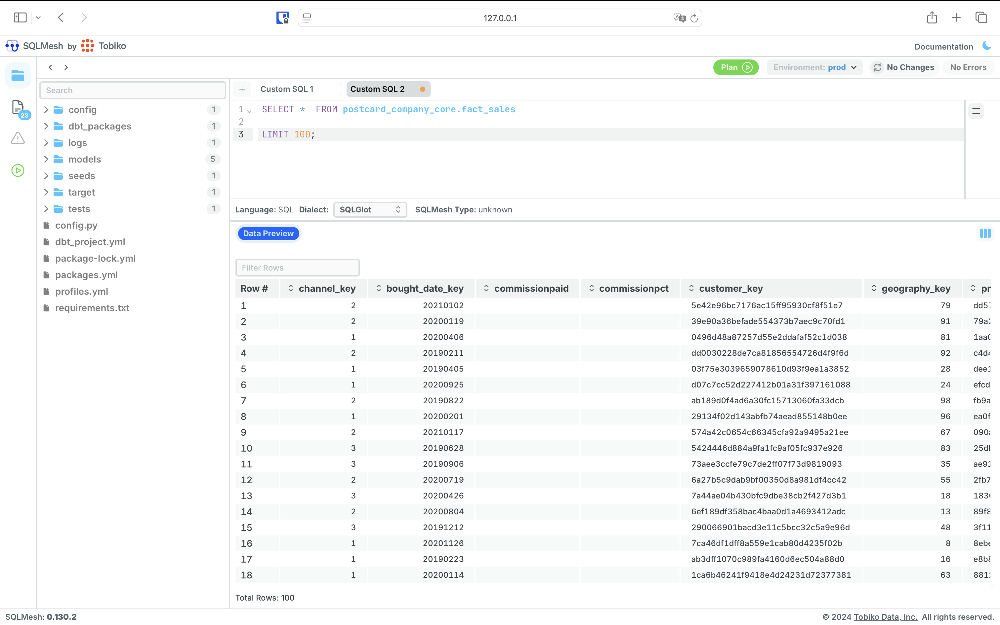

# Portable Data Stack with SQLMesh

This application is a containerized Analytics suite for an imaginary company selling postcards. The company sells both directly but also through resellers in the majority of European countries.

## Stack

- Docker (docker compose)
- DuckDB
- SQLMesh using dbt adapter
- Superset

## Interested in the data model?

Generation of example data and the underlying dbt-core model is available in the [postcard-company-datamart](https://github.com/cnstlungu/postcard-company-datamart) project.  

## For other stacks, check the below:
- [portable-data-stack-dagster](https://github.com/cnstlungu/portable-data-stack-dagster)
- [portable-data-stack-airflow](https://github.com/cnstlungu/portable-data-stack-airflow)
- [portable-data-stack-mage](https://github.com/cnstlungu/portable-data-stack-mage)

### System requirements
* [Docker](https://docs.docker.com/engine/install/)

## Setup

1. Rename `.env.example` file to `.env` and set your desired Superset password. Remember to never commit files containing passwords or any other sensitive information.

2. Rename `shared/db/datamart.duckdb.example` to `shared/db/datamart.duckdb` or init an empty database file there with that name.

3. With **Docker engine** installed, change directory to the root folder of the project (also the one that contains docker-compose.yml) and run

    `docker compose up --build`

4. Once the Docker suite has finished loading, open up [SQLMesh Web UI](http://localhost:8000)

Click on *Plan* 

Then *Apply Changes*

Upon the changes being applied, you can query the datamart via the SQL interface:

5. To explore the data and build dashboards you can open the [Superset interface](http://localhost:8088)

### Demo Credentials

Demo credentials are set in the .env file mentioned above. 

### Ports exposed locally
* SQLMesh: 8000
* Superset: 8088

Generated Parquet are saved in the **shared/parquet** folder.

The data is fictional and automatically generated. Any similarities with existing persons, entities, products or businesses are purely coincidental.

### General flow

1. Test data is generated as Parquet files - using Python (generator)
2. Data is import from parquet files to staging area in the Data Warehouse (DuckDB)
3. The data is modelled, building fact and dimension tables, loading the Data Warehouse using SqlMesh (with the dbt adapter for model compatibility)
4. Analyze and visually explore the data using Superset or directly querying the datamart via the SQL IDE provided by SQLMesh

For superset, the default credentials are set in the .env file: user = admin, password = admin

## Overview of architecture

The docker process will begin building the application suite. The suite is made up of the following components, each within its own docker container:
* **generator**: this is a collection of Python scripts that will generate, insert and export the example data, using [postcard-company-datamart](https://github.com/cnstlungu/postcard-company-datamart) project
* **sqlmesh-dbt**: the data model, sourced from [postcard-company-datamart](https://github.com/cnstlungu/postcard-company-datamart) project
* **superset**: this contains the web-based Business Intelligence application we will use to explore the data; exposed on port 8088.

Once the docker building process has completed, we may open the Mage GUI (locally: localhost:6789) to view the orchestration of our tasks.

After the DAGs have completed you can either analyze the data using the querying and visualization tools provided by Superset (available locally on port 8088), or query the Data Warehouse (available as a DuckDB Database)

