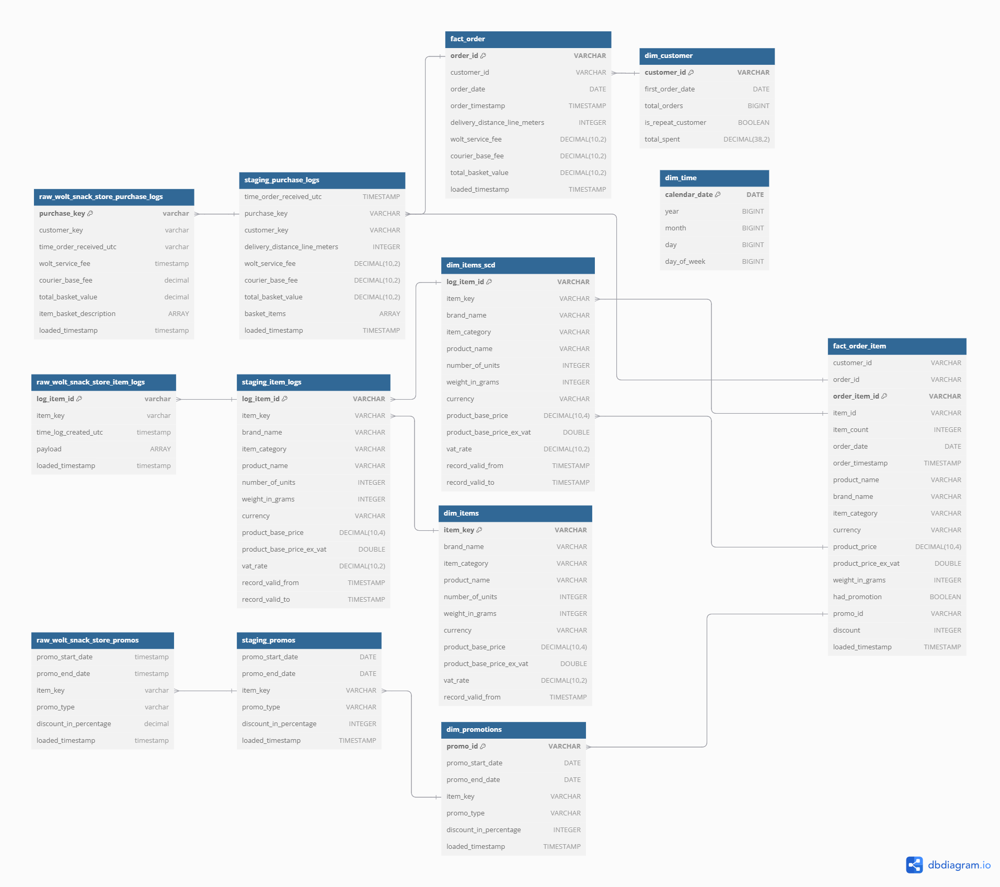
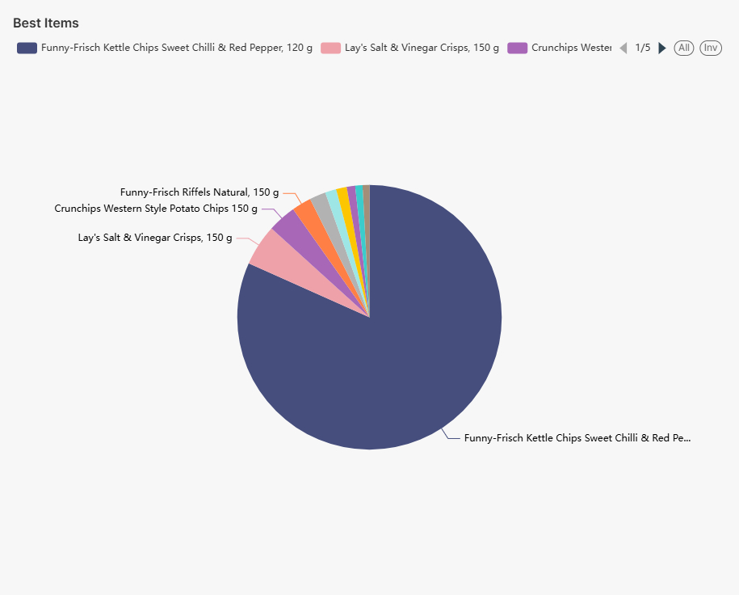
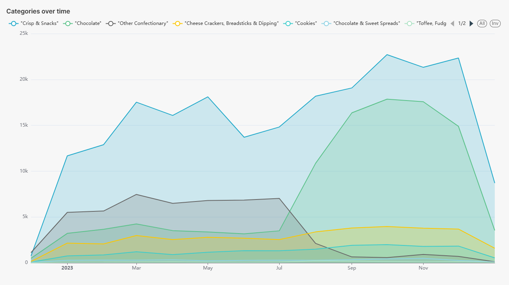
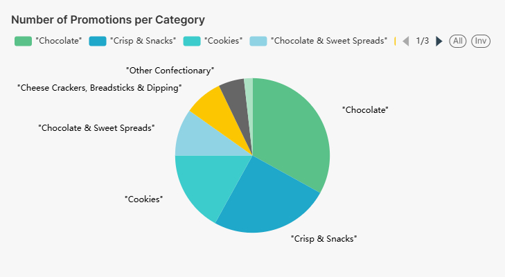
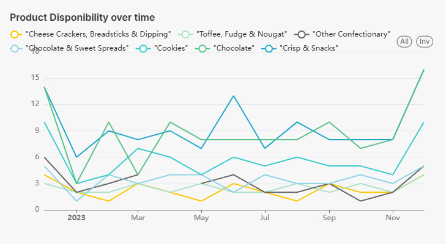
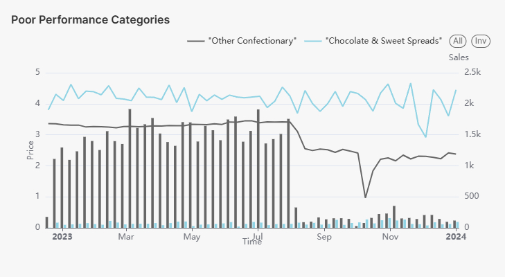
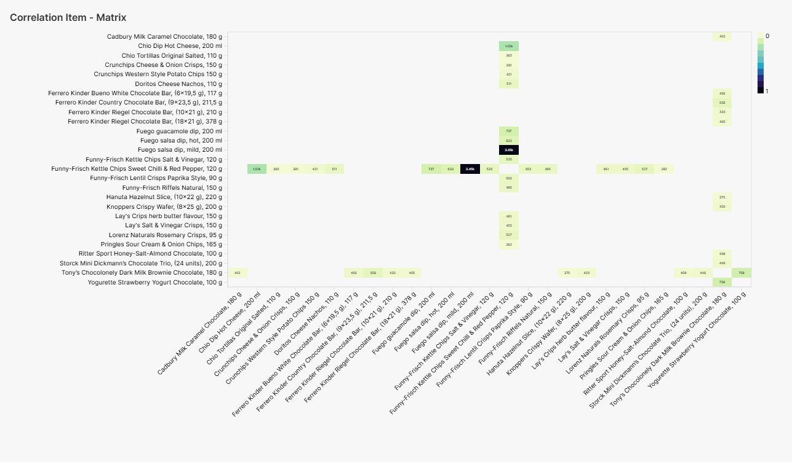
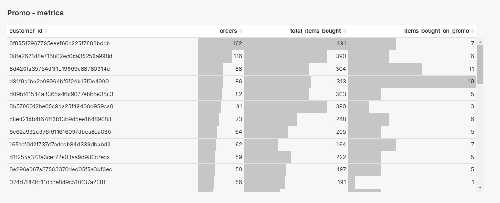
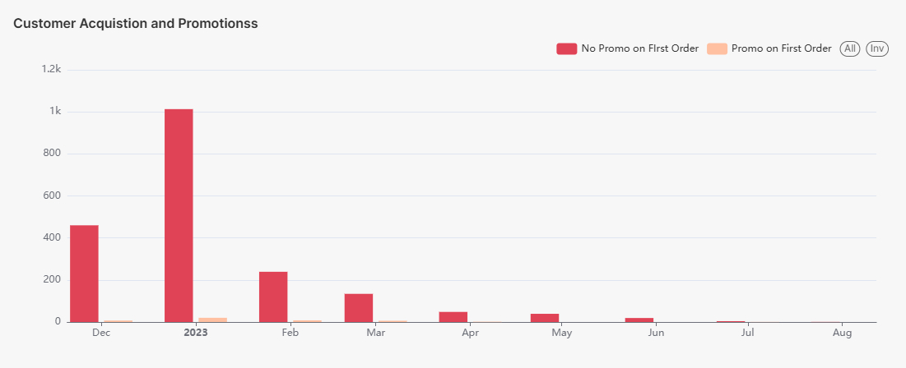

# Portable Data Stack with SQLMesh

This application is a containerized Analytics suite for analyzing the data from Wolt-Snack-Store project.

## Stack

- Docker (docker compose)
- DuckDB
- SQLMesh using dbt adapter
- Superset

## Data Model
The data model is based on the [Wolt Snack Store Data Model](https://github.com/nmirson-ml/wolt_interview), which simulates Wolts Snack Store's transactional data. The model follows a star schema design with fact and dimension tables to analyze customer purchases, items, promotions and time-based patterns.

## Dashboard Posibilities. 

For looking into metrics and the 2nd part of the excercise, a dashboard created using Superset allows to explore the data and build ad-hoc analysis. 

"Crisp & Snacks" and "Chocolate" see consistent demand but surge during specific months (e.g., earlier months of the year).
Categories like "Other Confectionary" experience sharp declines mid-year, reflecting seasonal trends or shifts in preferences.

When we think of categories, we can see that the most popular categories are "Crisps & Snacks" and "Chocolate".
A big reason for this, is that these two categories have not just the most associated items but also the most promotions. 
The best product, is "Funny-Frisch Kettle Chips Sweet Chilli & Red Pepper, 120g" and "Lay’s Salt & Vinegar Crisps, 150g" dominate as best sellers in the Crisps & Snacks Category

Poor performance is observed in "Other Confectionary" and "Chocolate & Sweet Spreads", with declining sales over time and low product availability as seen in the poor-performance and availability-over-time charts. High prices and reduced consumer interest may contribute to this.

In here we can see what are the items that are more often bought together. The correlation matrix highlights strong associations, such as between "Funny-Frisch Kettle Chips" variations and related snack items.

There are just a handful of first-time customers acquired through promotions, as evident in the "Customer Acquisition and Promotions" chart.
Most first-time customers purchase non-promotional items, indicating promotions is not the main driver of new customers. These customers are buying items that are not on promotion as the ratio between promotional and non-promotional items is quite healthy.

The full dashboard {image} can be found [here](resources/wolt_snack_store_dashboard.pdf)
Since it's locally stored in superset, the dashboard won't be available once the container is stopped or recreated. 

### System requirements
* [Docker](https://docs.docker.com/engine/install/)

## Setup

1. Create `.env` file and set your desired Superset password.

For example: 

SUPERSET_ADMIN=admin
SUPERSET_PASSWORD=admin
SUPERSET_SECRET_KEY=admin            

2. Create a empty database with duckdb using the database_init.py script:

    `python database_init.py`

3. With **Docker engine** installed, change directory to the root folder of the project (also the one that contains docker-compose.yml) and run

    `docker compose up --build`

4. Once the Docker suite has finished loading, open up [SQLMesh Web UI](http://localhost:8000)

5. To explore the data and build dashboards you can open the [Superset interface](http://localhost:8088)

### Demo Credentials

Demo credentials are set in the .env file mentioned above. 

### Ports exposed locally
* SQLMesh: 8000
* Superset: 8088

The data comes from the CSV files shared in Wolt-Snack-Store project. 

### General flow

1. The data is modelled, building fact and dimension tables, loading the duckdb instance using SqlMesh (with the dbt adapter for model compatibility)
2. Analyze and visually explore the data using Superset or directly querying the datamart via the SQL IDE provided by SQLMesh

For superset, the default credentials needs to e set in the .env file: user = admin, password = admin

## Overview of architecture

The docker process will begin building the application suite. The suite is made up of the following components, each within its own docker container:
* **sqlmesh-dbt**: the data model, sourced from [wolt_snack_store](https://github.com/nmirson-ml/wolt_interview) project
* **superset**: this contains the web-based Business Intelligence application we will use to explore the data; exposed on port 8088.

After the DAGs have completed you can either analyze the data using the querying and visualization tools provided by Superset (available locally on port 8088), or query the Data Warehouse (available as a DuckDB Database)

This repo is a fork of the original [portable-data-stack-sqlmesh](https://github.com/cnstlungu/portable-data-stack-sqlmesh) project, with some changes to the docker-compose file and the generation of the model, to allow running the superset on top of the duckdb instance created by sqlmesh. 